<p align="center">
  
</p>

<p align="center">
  
</p>

### `$ pip freeze | grep stack`

```
Python          proficient
Linux           proficient
Git             proficient
Nmap            learning
Wireshark       learning
Tcpdump         learning
SQL/SQLite      learning
FastAPI         learning
Kali-Linux      home-lab
```

### `$ ls -la ~/projects`

| repo | descrição |
|---|---|
| 🛡️ [`shield.py`](https://github.com/tatucode/shield.py) | scanner de arquivo e URL via VirusTotal API, hash SHA-256 |
| 🔐 [`file-integrity-checker`](https://github.com/tatucode/file-integrity-checker) | monitoramento de integridade de arquivo via hash SHA-256 |
| 🪪 [`profile-card`](https://github.com/tatucode/profile-card) | card de perfil digital, HTML5/CSS3, estética Hack The Box |
| 🧭 [`cybersecurity-journey`](https://github.com/tatucode/cybersecurity-journey) | writeups de máquinas do Hack The Box |

### `$ cat github-stats.log`

<p align="center">
  
  
</p>

<p align="center">
  
</p>

### `$ ./contribution_grid.sh --animate`

<p align="center">
  
</p>

### `$ cat contact.txt`

<p align="left">
  <a href="https://www.linkedin.com/in/pedropereiraalves/" target="_blank">
    
  </a>
  <a href="mailto:pedroalves.tech@outlook.com">
    
  </a>
  <a href="https://profile-card-eta-ten.vercel.app/" target="_blank">
    
  </a>
</p>
